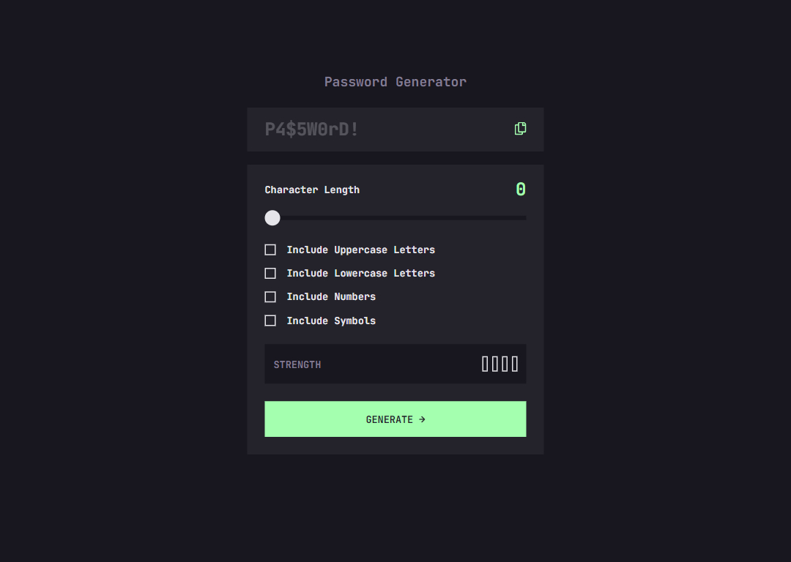

# Frontend Mentor - Password generator app solution

This is a solution to the [Password generator app challenge on Frontend Mentor](https://www.frontendmentor.io/challenges/password-generator-app-Mr8CLycqjh). Frontend Mentor challenges help you improve your coding skills by building realistic projects. 

## Table of contents

- [Overview](#overview)
  - [The challenge](#the-challenge)
  - [Screenshot](#screenshot)
  - [Links](#links)
- [My process](#my-process)
  - [Built with](#built-with)
  - [What I learned](#what-i-learned)
  - [Continued development](#continued-development)
  - [Useful resources](#useful-resources)
- [Author](#author)
  - [Connect with Me](#Connect-with-Me)
  - [Coding Profiles](#Coding-Profiles)

## Overview

### The challenge

Users should be able to:

- Generate a password based on the selected inclusion options
- Copy the generated password to the computer's clipboard
- See a strength rating for their generated password
- View the optimal layout for the interface depending on their device's screen size
- See hover and focus states for all interactive elements on the page

### Screenshot




### Links

- [Solution URL](https://github.com/DalaScript/password-generator-app)
- [Live Site URL](https://DalaScript.github.io/password-generator-app/)

## My process

### Built with

- Semantic HTML5 markup
- CSS custom properties
- Flexbox
- Mobile-first workflow
- JavaScript
- bem - [Block Element Modifier](https://getbem.com/introduction/)
- scss - [Sassy Cascading Style Sheets](https://sass-lang.com/documentation/at-rules/control/for/)

### What I learned

It was a very interesting project and gave me great experience.

In this project, I worked extensively with range and checkbox input types, customizing their styles to look different from the default inputs.

I also wrote the logic for the slider input, which I did for the first time, and it was a very interesting experience.

I also learned how to copy text with a click of a button.

CSS pseudo-elements that I used for the first time.
```scss
/* Thumb: for Chrome, Safari, Edge */
&::-webkit-slider-thumb {}

/* Thumb: for Firefox */
&::-moz-range-thumb {}
```

### Continued development

I have already completed two JavaScript courses on freeCodeCamp, and I am currently taking the Front End Development Libraries course, where I’ve finished Bootstrap, jQuery, and Sass, and I’m now working through React.

Alongside this, I am working on projects and following a learning path on Frontendmentor.

### Useful resources

- [ChatGPT](https://chatgpt.com/) - He is my hero, if I need something fast, if I can't understand something, or if I can't find it on the internet, I always ask him.
- [W3Schools](https://www.w3schools.com/) - This is my favorite documentation platform I've been using since I started programming, it's the best explained resource.
- [YouTube](https://www.youtube.com/) - I'm always looking for news and listening to other developers, sharing their experiences so that I can see many different solutions to a problem.

## Author

### Connect with Me

- [Instagram](https://www.instagram.com/DalaScript)
- [YouTube](https://www.youtube.com/@DalaScript)

### Coding Profiles

- [freeCodeCamp](https://www.freecodecamp.org/DalaScript)
- [FrontendMentor](https://www.frontendmentor.io/profile/DalaScript)
- [GitHub](https://github.com/DalaScript)